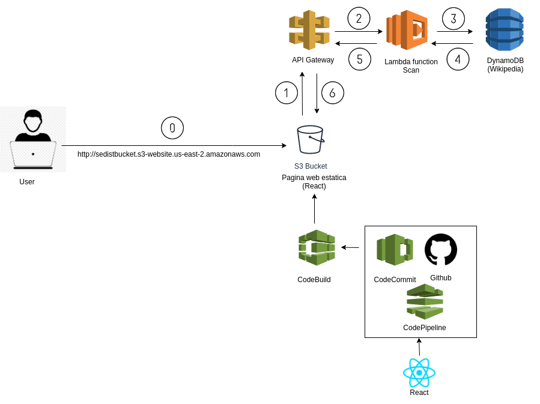

# Search Engine para Sistemas Distribuidos

## Integrantes

* Cristobla Becerra
* Leiser Mahu
* Nicolás Olivares

La descripción de cada sistema desplegable se encuentra en el README.md de cada carpeta correspondiente.

En líneas generales, este repositorio contiene la arquitectiura presentada en la figura:



La explicacion de cada uno de los componentes de este sistema estaran descritos a continuacion:

## AWS CodePipeline aplicado
```
1. Commit: los commits nuevos en la rama origin/master 
son capturados por AWS CodePipeline mediante webhooks
```
```
2. Build: Mediante un archivo de especificación de configuración (configuration/buildspec.yml) 
se construye la aplicación y se sincroniza el resultado en un bubket de S3 
desde donde se puede acceder a la página estática pública
```
La pagina esta desplegada en: http://sedistbucket.s3-website.us-east-2.amazonaws.com/

La aplicación web construida fue implementada usando el framework ReactJS. 
Basado en la documentación de Facebook de: This project was bootstrapped with [Create React App] en (https://github.com/facebook/create-react-app).

## Sistema API Gateway, AWS Lambda y DynamoDB

Para este sistema distribuido se uso Amazon Web Services, en concrreto estos 3 componentes que tienen las siguientes funcionalidades:

* 1. API Gateway: Este servicio provee una API REST para acceder a los datos.
En este caso tiene un endpoint con un GET para obtener la busqueda que realiza el usuario

* 2. AWS Lambda: Servicio que hace correr el codigo para manegar servidores la cual se encarga de escalarlo 
con gran disponibilidad. 
En este caso recibe el request del componente API Gateway y se comunica con la base de datos de DynamoDB
para sacar todos los terminos que concuerden con la busqueda.

* 3. DynamoDB: Servicio de una base de datos noSQL de llave-valor en donde esta alojado los titulos 
de una base de datos Wikipedia


A continuacion esta el analisis de la arquitectura:


## Rendimiento 
Hablando de rendimiento, AWS declara poseer computabilidad de gran rendimiento.
Una de las razones es tener CPUs diseñados especialmente para Amazon por parte de Intel las cuales, entre otras características, poseen 5 configuraciones, desde 2 a 36 cores virtuales cpu y desde 3.75GB a 60GB de RAM cada uno(fuente:https://www.datacenterknowledge.com/archives/2014/11/13/intel-designs-custom-aws-cpu-for-fastest-ec2-instances-ever)

Con respecto a escalabilidad, Al usar muchos de los servicios de AWS, este provee un servicio de auto escalamiento el cual monitorea la “salud” de las instancias que estén corriendo, repara estas instancias automáticamente y realiza el balance de sus recursos a través de las zonas disponibles que posea Amazon (fuente: https://aws.amazon.com/ec2/autoscaling/).
Debido a que se utilizo los servicios de amazon web services, se espera confianza en que los sistemas esten disponibles debido a contar con SoftNAS, una red definida de software la cual declara que provee 99,999% de disponibilidad por año (fuente: https://aws.amazon.com/marketplace/solutions/infrastructure-software/high-availability).


## Tolerancia a fallas y Disponibilidad 
La arquitectura implementada está soportada por los servicios de Amazon Web Services los cuales, empresa que otorga máxima seguridad a la hora de implementar Software como Servicio (SaaS), contando con todas las herramientas para levantar una arquitectura distribuida, aún en su capa gratuita, cuenta con elementos como: 

* API Gateway: para el manejo de las request http o a funciones lambda.

* S3: Nos permite almacenar una aplicación web estática, así como también el despliegue de pasos intermedios como construcción de aplicaciones.

* CodePipeline y CodeBuild: utilizando los servicios de AWS se puede generar una corriente de CI/CD o como se le conoce, Integración y Despliegue continuo.

* DynamoDB: motor de base de datos noSQL, permite el almacenamiento de la información necesaria para prestar los servicios dentro de la arquitectura

En resumen, el uso de AWS nos asegura, estabilidad, tolerancia a falla ya que se puede permitir la escalabilidad de los componentes desplegados, con réplicas y redundancias, como por ejemplo una replicación de bases de datos, frontend, API Gateway para controlar el flujo de request (incluso podría dirigirse el tráfico a API Gateways replicadas en caso de superar algún umbral de utilización de la red).

## Paralelización de la consulta
En DynamoDB las operaciones Scan procesan los datos de manera secuencial devolviendolos en incrementos de 1MB, sin embargo al operar sobre tablas muy automáticamente la operación se puede dividir en diferentes segmentos examinables en paralelo generando diferentes workers para cada uno agilizando así la consulta y retorno de datos. En esta implementación también se utilizó una función lambda para realizar la consulta a DynamoDB, en AWS cada función lambda puede correr de manera paralela en distintos containers, permitiendo explotar la paralelización de consultas en caso de que diferentes usuarios realicen consultas simultáneas desde el cliente.

## Distribución de la base de datos
La tecnología DynamoDB permite realizar una implementación distribuida de las tablas almacenadas mediante diferentes instancias de la base de datos en múltiples regiones de AWS distribuidas de acuerdo al contexto de la solución, sin embargo no fue posible generar un desplegable explotando esta funcionalidad por limitaciones del plan gratuito de AWS.

